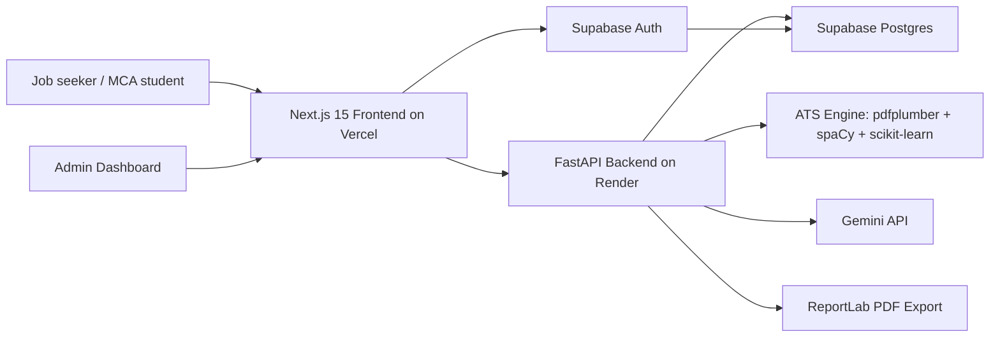

# Production Architecture

## Frontend

- Next.js 15 App Router
- React 19
- Tailwind CSS
- Framer Motion for product interaction animations
- React Hook Form for resume editing
- Zustand for local draft and theme persistence
- Supabase Auth client hooks

## Backend

- FastAPI route groups: health, ATS, AI, resumes
- `pdfplumber` extracts PDF text and detects tables/column risks
- `spaCy` supplies NLP tokenization when `en_core_web_sm` is installed
- `scikit-learn` TF-IDF cosine similarity supports semantic keyword scoring
- Gemini handles summaries, rewrites, achievements, skill suggestions, interview questions, and job-match analysis
- ReportLab exports clean single-column PDFs

## Data

Supabase tables:

- `users`
- `resumes`
- `ats_reports`
- `templates`
- `ai_history`

Row-level security keeps user-owned resumes, reports, and AI history private. Templates are publicly readable when active.
